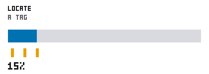
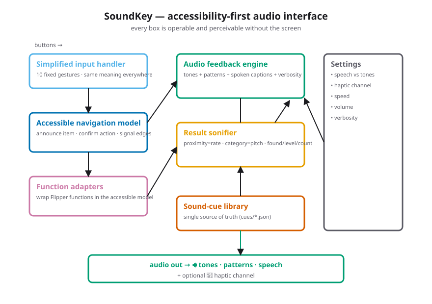
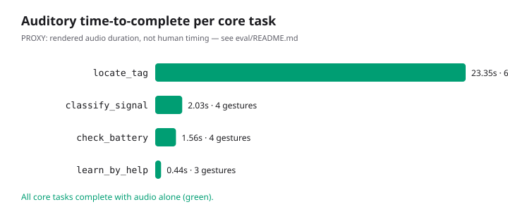
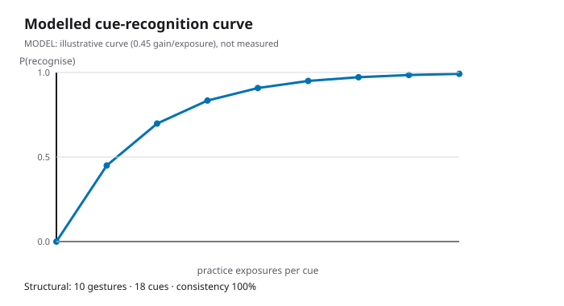
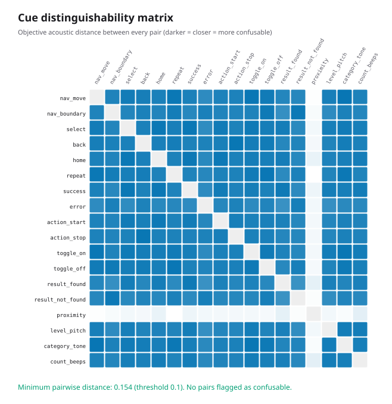

# 🔊 SoundKey — an accessibility-first audio interface for Flipper Zero

> **The Flipper Zero is a screen-first device.** Almost everything depends on
> reading a small display and navigating visual menus — which makes large parts
> of it effectively unusable for blind and low-vision people. The whole ecosystem
> is built visual-first, and almost nobody builds for accessibility.
>
> **SoundKey closes that gap.** It turns the Flipper's common functions into
> sound — spoken and tonal feedback, sound-cue navigation, "geiger-style"
> proximity feedback, and a simplified, predictable set of controls — so the
> device can be operated **without ever looking at the screen**.

**Who this helps:** blind and low-vision Flipper users, and anyone who wants to
operate the device eyes-free. **What it is:** a cohesive, screen-free interaction
model + a reusable audio-feedback framework + a documented, distinguishability-
checked sound-cue library — plus a desktop simulator so you can *hear* it right
now, with no hardware.

**Sole contributor:** this project is created and maintained solely by
**Krishita Sanjay Choksi**. She is the only contributor; all design, code, the
cue library, the simulator, the evaluation, the figures, the audio, and the
documentation are her work.

> **Repo description:** 🔊 SoundKey — accessibility-first audio interface for
> Flipper Zero. Spoken and tonal feedback, sound-cue navigation, and simplified
> controls so blind and low-vision users can use the device. Sole contributor:
> Krishita Sanjay Choksi.

---

## 👂 Hear it first

Accessibility projects live or die on being *experienced*. Start here:

- 🎬 **Watch the locate-a-tag demo:** [`media/demo_locate_tag.gif`](media/demo_locate_tag.gif)



- 🔉 **Hear a full task** (download & play): [`media/flow_locate_tag.wav`](media/flow_locate_tag.wav)
  — the geiger click-rate accelerates as the target gets closer, then a bright
  "found" motif. This one clip is the fastest way to understand SoundKey.
- 🔉 More: [`flow_classify_signal.wav`](media/flow_classify_signal.wav) ·
  [`flow_check_battery.wav`](media/flow_check_battery.wav) · one `cue_*.wav` per cue.

Or generate and play everything yourself, no Flipper needed (standard library only):

```bash
cd sim
python3 -m soundkey_sim.cli flow locate_tag --play
python3 -m soundkey_sim.cli play proximity --level 0.9 --play
```

---

## 🧭 Honest prior art (read this)

The Flipper **already** has a piezo speaker (`furi_hal_speaker`) and a vibration
motor (`furi_hal_vibro`); many apps beep, and rate-coded "geiger" feedback is a
long-known idea. **SoundKey did not invent on-device sound on the Flipper.**

What SoundKey contributes is the *first cohesive accessibility interface and
reusable audio-feedback framework* for the device: a designed, learnable,
screen-free way to navigate and operate it, a documented cue language, and a
simulator to build accessibility with. Full detail — and full credit to what
came before — is in [`docs/prior_art.md`](docs/prior_art.md).

---

## 🏗️ Architecture

Every box is operable and perceivable **without the screen**.



Source (also renders on GitHub): [`figures/architecture.mmd`](figures/architecture.mmd) ·
regenerate with `python3 figures/generate_figures.py`.

| Component | Role |
|---|---|
| **Simplified input handler** | Ten fixed gestures; the same gesture means the same thing everywhere. |
| **Accessible navigation model** | Announces the focused item, confirms actions, signals list edges — never needs the display. |
| **Audio feedback engine** | Renders menus/states/results as tones, patterns, and spoken captions, with verbosity control. |
| **Function adapters** | Wrap common Flipper functions in the accessible model. |
| **Result sonifier** | proximity = click-rate · level = pitch · category = note · count = beeps · found/not-found motifs. |
| **Sound-cue library** | The single source of truth (`cues/*.json`) every layer reads from. |
| **Settings** | speech vs. tones · haptic channel · speed · volume · verbosity. |

---

## 🎵 Sound-cue legend (the interface, made legible)

_Generated from [`cues/cue_library.json`](cues/cue_library.json) — the hero
artifact. `·Nms` is a silent gap._

| Cue ID | State / result | Sound (tones · patterns) | Spoken caption | Group |
|---|---|---|---|---|
| `nav_move` | Move to next/previous item | 700Hz/30ms | `{item}` | navigation |
| `nav_boundary` | Edge of a list (no wrap) | 300Hz/40ms → ·30ms → 300Hz/40ms | `edge` | navigation |
| `select` | Select / activate item | 660Hz/45ms → ·20ms → 880Hz/60ms | `{item}, opening` | navigation |
| `back` | Go back / cancel | 660Hz/45ms → ·20ms → 440Hz/60ms | `back` | navigation |
| `home` | Returned to home / main menu | 523 → 659 → 784 Hz (rising) | `home` | navigation |
| `repeat` | Repeat last announcement | 500Hz/25ms | `{item}` | navigation |
| `success` | Action succeeded | 660 → 990 Hz (rising "ta-da") | `done` | status |
| `error` | Action failed / not allowed | 340 → 200 Hz (falling buzz) | `error` | status |
| `action_start` | A running action started | 392 → 784 Hz (octave leap up) | `started` | status |
| `action_stop` | A running action stopped | 784 → 392 Hz (octave leap down) | `stopped` | status |
| `toggle_on` | Setting turned on | 740Hz ×2 (flat high double) | `{item} on` | status |
| `toggle_off` | Setting turned off | 466Hz ×2 (flat low double) | `{item} off` | status |
| `result_found` | Target found | 880 → 1180 → 1480 Hz (bright triad) | `found {detail}` | result |
| `result_not_found` | Nothing found | 260Hz/220ms (flat low) | `nothing found` | result |
| `proximity` | Proximity / signal strength | click stream, 1–25 Hz (faster = closer) | `{percent} percent` | result |
| `level_pitch` | Continuous value as pitch | 300–1200 Hz over the value | `{percent} percent` | result |
| `category_tone` | Category as distinct tone | note on a rising scale (523–988 Hz) | `category {n}` | result |
| `count_beeps` | Small count as beeps | 740Hz beep × N | `{count}` | result |

Cues are checked for **distinguishability** in CI — no two may drift close enough
to confuse by ear (see [Evaluation](#-evaluation)).

---

## 🎮 Gesture map (learn ten gestures, once)

_Long-press threshold: 500 ms. The same gesture means the same thing on every
screen — learnability over cleverness._

| Button | Press | Action | Meaning |
|---|---|---|---|
| Up | short | previous item | Move focus up; the new item is announced. |
| Down | short | next item | Move focus down; the new item is announced. |
| OK | short | select | Select / activate the focused item, or toggle a setting. |
| Back | short | back | Go back one level, or cancel. |
| Left | short | decrease | Decrease a value, or previous category/field. |
| Right | short | increase | Increase a value, or next category/field. |
| OK | **long** | primary run | Start/stop the screen's primary action (e.g. a scan). |
| Back | **long** | home | Jump straight back to the home menu. |
| Up | **long** | repeat | Repeat the last announcement. |
| Down | **long** | help | Announce where you are and what's available here. |

---

## 📦 Install

### On the Flipper (qFlipper drag-to-SD)
1. Build the app (below) to get `soundkey.fap`.
2. With [qFlipper](https://flipperzero.one/update), copy `soundkey.fap` to the SD
   card under `apps/Tools/`.
3. On the device: **Apps → Tools → SoundKey (Accessibility)**.

### Build the app (ufbt)
```bash
python3 -m pip install --upgrade ufbt
python3 cues/generate_c_header.py   # sync the cue table from the source of truth
ufbt                                # builds .ufbt/build/soundkey.fap
ufbt launch                         # build + upload + run over USB
```
See [`build/README.md`](build/README.md) for details and the honest status of the
on-device app vs. the continuously-tested simulator.

### Run the simulator (no hardware, no dependencies)
```bash
cd sim && python3 -m soundkey_sim.cli flows
```

---

## 📊 Evaluation

Run `python3 eval/run_eval.py`. Three measures, each labelled by how much to
trust it (full detail + honesty notes in [`eval/README.md`](eval/README.md)):

| Measure | Chart | Status |
|---|---|---|
| Screen-free task completion |  | **Proxy** — rendered-audio timing, *not* human data |
| Learnability |  | Structural facts + an explicit model |
| Cue distinguishability |  | **Objective** — enforced in CI |

The distinguishability check already earned its keep: it caught a real collision
in development (`back` and `action_stop` were once acoustically identical) and
now fails the build if any two cues get too close.

---

## 🧩 Coverage & roadmap

Starter set of screen-free functions (the shapes that suit audio best):

| Function | Accessible? | How it's conveyed |
|---|---|---|
| Proximity locator | ✅ | geiger click-rate + found/not-found motif |
| Signal classifier | ✅ | category as a distinct note |
| Battery readout | ✅ | value as pitch |
| Saved-tag count | ✅ | count as beeps |
| Vibration setting | ✅ | toggle-on / toggle-off cues |

**Roadmap:** richer spoken output (TTS/clips) where hardware allows · more
scanner adapters wired to real sensors · a stronger haptic language for
deaf-blind users and noisy environments · and — most important — **iteration
with real blind and low-vision users** (see below).

---

## 🤝 Built *with* users — feedback welcome

Real accessibility needs input from the people it serves. **Version 1 is a
foundation, not a finished claim.** If you are a blind or low-vision Flipper user
(or work in assistive tech), your feedback is the most valuable contribution this
project can get — open an issue describing your setup and what worked or didn't.
Guidance for testing and the specific questions we most want answered are in
[`docs/accessibility.md`](docs/accessibility.md).

---

## ⚠️ Honest limits

- **The tested, run-anywhere part is the simulator.** The on-device `.fap` is a
  functional accessibility skeleton written against the official firmware API; it
  needs the Flipper SDK to compile, so CI exercises the simulator, the cue
  library, the evaluation, and the demos — not a hardware build.
- **Eyes-closed testing is a proxy, not the real thing.** It catches obvious
  failures early but does not stand in for testing with blind and low-vision
  users. The eval numbers are labelled accordingly.
- **On-device speech is limited.** v1 leans on a tonal cue language; the
  simulator shows speech as time-aligned captions. Richer TTS is on the roadmap,
  and nothing in the design depends on speech being present.
- **v1 covers a starter set of functions**, chosen because they suit audio well.
  Broader coverage is roadmap work.
- **Not medical, legal, or safety-critical.** SoundKey adds no offensive
  capability and where it wraps a Flipper function it inherits that function's
  own responsible-use notes — see [`docs/threat_model.md`](docs/threat_model.md).

---

## 🗂️ Repository layout

```
soundkey-flipperzero/
├── application.fam        Flipper app manifest
├── src/                   On-device app (input, nav, audio engine, adapters) + generated cue header
├── cues/                  Sound-cue library + gesture map (single source of truth) + C-header generator
├── sim/                   Desktop simulator (hear the interface, no hardware)
├── eval/                  Screen-free task, learnability, distinguishability + charts
├── media/                 Audio demos (WAV + transcripts) and the demo GIF
├── figures/              Architecture, flow diagrams, legend/gesture tables (all generated)
├── docs/                  accessibility · prior_art · framework_guide · threat_model
├── build/                 ufbt build notes
└── tests/                 Standard-library test suite (runs in CI)
```

## 📄 License & citation

MIT © 2026 **Krishita Sanjay Choksi**. See [`LICENSE`](LICENSE). Citation
metadata in [`CITATION.cff`](CITATION.cff). Sole author and only contributor:
**Krishita Sanjay Choksi**.
